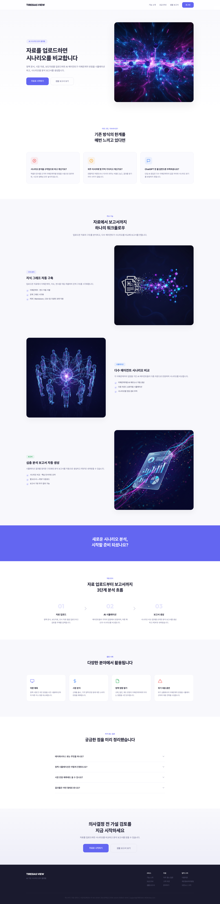
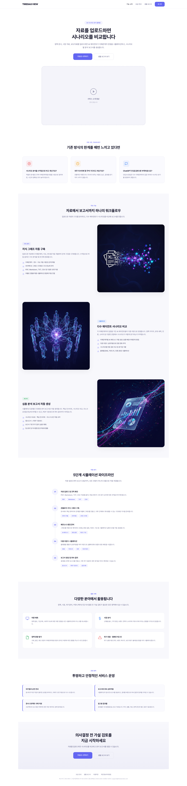
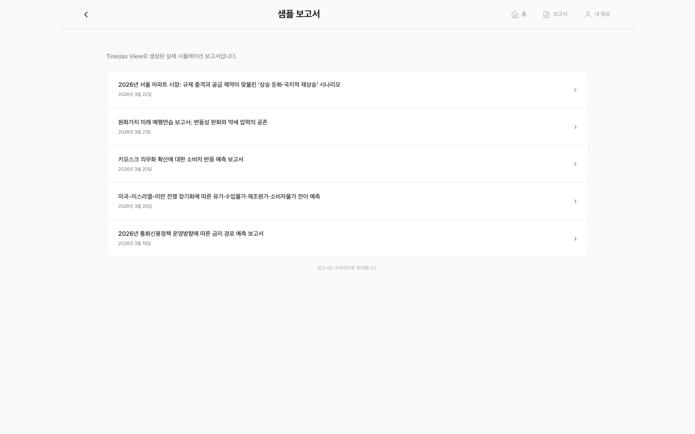
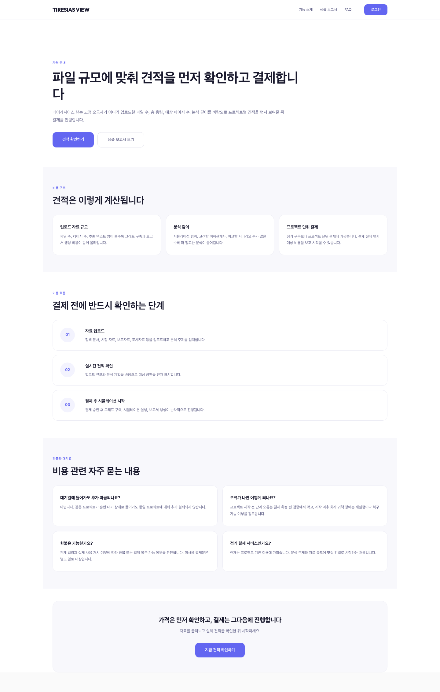

# Google Ads API Design Document

**Application Name:** Tiresias View - Internal Advertising Management Tool
**Company:** Maven Works
**Developer Contact:** nov9306@gmail.com
**Google Ads Customer ID:** 816-594-3772
**Manager Account ID:** 548-173-6491
**Date:** 2026-03-30
**Website:** https://tiresiasview.com

---

## Table of Contents

1. [Product Overview](#1-product-overview)
2. [Google Ads API Use Case](#2-google-ads-api-use-case)
3. [Tool Type](#3-tool-type)
4. [API Features Used](#4-api-features-used)
5. [Technical Architecture](#5-technical-architecture)
6. [Campaign Management Flow](#6-campaign-management-flow)
7. [Conversion Tracking Flow](#7-conversion-tracking-flow)
8. [Reporting Flow](#8-reporting-flow)
9. [Screenshots](#9-screenshots)
10. [Security and Compliance](#10-security-and-compliance)

---

## 1. Product Overview

**Tiresias View** is a B2B SaaS platform that provides AI-powered scenario analysis and simulation reports. Users upload policy documents, market data, or news articles, and the platform simulates stakeholder reactions across different scenarios, generating comprehensive analysis reports.

The platform is live and operational at **https://tiresiasview.com** with paying customers in South Korea.

### Key Features
- Document upload and AI-powered knowledge graph construction
- Multi-agent stakeholder simulation
- Scenario comparison and analysis report generation
- PDF report download


*Figure 1: Tiresias View landing page - live production site*


*Figure 2: Features overview page*


*Figure 3: Sample reports generated by the platform*


*Figure 4: Pricing page - the platform accepts payments via Toss Payments*

---

## 2. Google Ads API Use Case

We are building an **internal advertising management tool** to manage Google Ads campaigns for our own product (Tiresias View). This is **NOT** a third-party tool or agency tool.

### Why We Need the API

1. **Campaign Management Automation**: We manage multiple search campaigns targeting different user intents (brand keywords, scenario analysis, policy simulation, market response, public opinion). The API allows us to programmatically sync campaign structures from version-controlled blueprint files, ensuring consistency and reproducibility.

2. **Conversion Tracking**: Our product has a multi-step conversion funnel (signup -> quote/estimate -> payment). We need the API to create and manage conversion actions, and to upload offline conversions that occur server-side after an ad click.

3. **Search Term Reporting**: We need to regularly analyze search term performance to optimize keywords and negative keyword lists for the Korean market.

### What We Will NOT Do
- We will NOT build a tool for third parties
- We will NOT access other advertisers' accounts
- We will NOT resell API access
- We will NOT automate bidding beyond Google's built-in strategies

---

## 3. Tool Type

**Internal Tool** - This tool is used exclusively by our own team to manage advertising for our own product (Tiresias View). Only our team members access the Google Ads API through this tool.

### Users of This Tool
- Our marketing team (1-2 people)
- Used via CLI scripts run on a secured development machine
- No external user-facing Google Ads interface

---

## 4. API Features Used

### 4.1 Campaign Management (Read + Write)

| API Service | Method | Purpose |
|-------------|--------|---------|
| `CampaignBudgetService` | `mutate` | Create/update daily budgets for campaigns |
| `CampaignService` | `mutate` | Create/update search campaigns |
| `CampaignCriterionService` | `mutate` | Set location targeting (KR), language targeting (ko), negative keywords |
| `AdGroupService` | `mutate` | Create/update ad groups within campaigns |
| `AdGroupCriterionService` | `mutate` | Add keywords (EXACT, PHRASE match types) |
| `AdGroupAdService` | `mutate` | Create responsive search ads |
| `GoogleAdsService` | `search` | Query existing resources before creating (deduplication) |

### 4.2 Conversion Tracking (Read + Write)

| API Service | Method | Purpose |
|-------------|--------|---------|
| `ConversionActionService` | `mutate` | Create conversion actions (signup, quote, purchase) |
| `ConversionUploadService` | `uploadClickConversions` | Upload server-side conversion events with gclid |

### 4.3 Reporting (Read Only)

| API Service | Method | Purpose |
|-------------|--------|---------|
| `GoogleAdsService` | `search` | Query `search_term_view` for search term performance reports |

---

## 5. Technical Architecture

```
┌─────────────────────────────────────────────────────────┐
│                    Tiresias View                         │
│                                                         │
│  ┌──────────────┐    ┌──────────────┐    ┌───────────┐  │
│  │   Frontend    │    │   Worker     │    │  Backend   │  │
│  │  (Vue 3)     │    │ (Cloudflare) │    │  (Flask)   │  │
│  │              │    │              │    │            │  │
│  │ - gtag init  │    │ - Auth/Pay   │    │ - Graph    │  │
│  │ - Click ID   │    │ - Projects   │    │ - Simulate │  │
│  │   capture    │    │ - Queue      │    │ - Report   │  │
│  │ - Conversion │    │              │    │            │  │
│  │   tracking   │    │              │    │            │  │
│  └──────┬───────┘    └──────────────┘    └────────────┘  │
│         │                                                │
└─────────┼────────────────────────────────────────────────┘
          │
          │  gtag.js events (online conversions)
          ▼
┌─────────────────────────────────────────────────────────┐
│              Google Ads Platform                         │
│                                                         │
│  ┌──────────────┐    ┌──────────────┐    ┌───────────┐  │
│  │  Campaigns   │    │ Conversions  │    │ Reporting  │  │
│  │              │    │              │    │            │  │
│  │ Brand Search │    │ signup       │    │ Search     │  │
│  │ Solution     │    │ quote        │    │ term view  │  │
│  │ Intent       │    │ purchase     │    │            │  │
│  └──────▲───────┘    └──────▲───────┘    └─────▲──────┘  │
│         │                   │                  │         │
└─────────┼───────────────────┼──────────────────┼─────────┘
          │                   │                  │
          │   Google Ads API v22 (REST)          │
          │                   │                  │
┌─────────┴───────────────────┴──────────────────┴─────────┐
│          Internal CLI Scripts (Node.js)                   │
│                                                          │
│  ads:campaign:sync   ads:conversions:create   ads:report │
│  ads:conversions:upload                  :search-terms   │
│                                                          │
│  Run by: Marketing team on secured dev machine           │
│  Auth: OAuth2 refresh token (stored in .env)             │
└──────────────────────────────────────────────────────────┘
```

### Technology Stack
- **Scripts Runtime:** Node.js (ES Modules)
- **API Version:** Google Ads API v22
- **Authentication:** OAuth 2.0 with refresh token
- **Frontend Tracking:** Google Tag (gtag.js)
- **Campaign Blueprints:** Version-controlled JSON files

---

## 6. Campaign Management Flow

### 6.1 Blueprint-Driven Campaign Sync

Campaign structures are defined in JSON blueprint files stored in the repository. This ensures all campaign changes are version-controlled and reviewable.

**Current Campaign Structure:**

| Campaign | Daily Budget | Ad Groups | Keywords |
|----------|-------------|-----------|----------|
| KR Search \| Brand \| Tiresias | 15,000 KRW | 1 (Brand Core) | 5 EXACT match |
| KR Search \| Solution Intent \| Tiresias | 50,000 KRW | 4 (Scenario Analysis, Policy Simulation, Market Response, Public Opinion) | 24 PHRASE match |

**Sync Process:**

```
1. Developer runs: npm run ads:campaign:sync
   (dry-run by default - shows what would be created)

2. Script loads blueprint JSON files from data/ directory

3. For each campaign in blueprint:
   a. GAQL query to check if campaign already exists
   b. If not: create budget → create campaign → set targeting → create ad groups → add keywords → create ads
   c. If exists: skip (no destructive updates)

4. Developer reviews dry-run output

5. Developer runs: npm run ads:campaign:sync --apply
   (actually creates resources via API mutate calls)
```

**Example Blueprint (brand-search.kr.json):**
```json
{
  "campaignName": "KR Search | Brand | Tiresias",
  "channelType": "SEARCH",
  "dailyBudgetKrw": 15000,
  "biddingStrategy": "MAXIMIZE_CLICKS",
  "locales": { "countryCodes": ["KR"], "languageCodes": ["ko"] },
  "adGroups": [{
    "name": "Brand Core",
    "keywords": [
      { "text": "tiresias view", "matchType": "EXACT" },
      { "text": "테이레시아스", "matchType": "EXACT" }
    ],
    "responsiveSearchAd": {
      "headlines": ["Tiresias View Official Site", ...],
      "descriptions": ["Upload documents and compare scenarios...", ...]
    }
  }]
}
```

### 6.2 Negative Keywords

A shared negative keyword list is maintained in `negative-keywords.kr.json` and applied to all campaigns during sync:

```
무료, 공짜, 뜻, 의미, 나무위키, 위키, 논문, 과제,
레포트, 채용, 연봉, 이미지, ppt, 템플릿
```

These filter out informational and irrelevant searches common in the Korean market.

---

## 7. Conversion Tracking Flow

### 7.1 Conversion Actions

We track three conversion events corresponding to our sales funnel:

| Conversion Action | Category | Counting | Lookback | Value |
|-------------------|----------|----------|----------|-------|
| `signup_complete` | SIGNUP | ONE_PER_CLICK | 30 days | Fixed (1) |
| `quote_requested` | LEAD | ONE_PER_CLICK | 30 days | Fixed (1) |
| `purchase_completed` | PURCHASE | ONE_PER_CLICK | 30 days | Dynamic (KRW) |

### 7.2 Online Conversion Tracking (Frontend)

The frontend captures Google Ads click parameters and fires conversion events via gtag.js:

```
User clicks Google Ad → lands on tiresiasview.com?gclid=xxx
                                    │
                                    ▼
                         marketing.js captures gclid,
                         gbraid, wbraid → localStorage
                                    │
                                    ▼
              ┌─────────────────────┼─────────────────────┐
              │                     │                     │
              ▼                     ▼                     ▼
        Signup success       Quote/Estimate        Payment success
              │                success                    │
              ▼                     │                     ▼
    trackGoogleAds             ▼              trackGoogleAds
    Conversion(              trackGoogleAds    Conversion(
    'signup_complete')       Conversion(       'purchase_completed',
                             'quote_requested') { value, currency })
```

**Frontend Integration Points:**
- `Signup.vue` → fires `signup_complete` on successful registration
- `Home.vue` → fires `quote_requested` on successful estimate
- `Credits.vue` → fires `purchase_completed` on successful payment (with transaction value)

**Deduplication:** `trackGoogleAdsConversionOnce()` prevents duplicate conversion events using localStorage-based dedup keys.

### 7.3 Offline Conversion Upload (Server-side)

For conversions that happen server-side or with delayed attribution:

```
1. Frontend captures click IDs (gclid/gbraid/wbraid) on ad landing
2. Click IDs are stored with user record on signup
3. When payment completes server-side, conversion data is exported to JSON
4. Marketing team runs: npm run ads:conversions:upload -- --file conversions.json
5. Script uploads via ConversionUploadService.uploadClickConversions()
```

**Conversion Upload JSON Format:**
```json
[{
  "conversionActionName": "purchase_completed",
  "conversionDateTime": "2026-03-21 18:45:00+09:00",
  "conversionValue": 17900,
  "currencyCode": "KRW",
  "orderId": "payorder_abc123",
  "gclid": "EAIaIQob..."
}]
```

---

## 8. Reporting Flow

### 8.1 Search Term Report

We use GAQL queries against `search_term_view` to analyze which search queries trigger our ads:

```
npm run ads:report:search-terms -- --days 14
```

**GAQL Query:**
```sql
SELECT
  campaign.name,
  ad_group.name,
  search_term_view.search_term,
  metrics.impressions,
  metrics.clicks,
  metrics.cost_micros,
  metrics.conversions,
  metrics.conversions_value
FROM search_term_view
WHERE segments.date DURING LAST_14_DAYS
  AND metrics.impressions > 0
ORDER BY metrics.clicks DESC
LIMIT 200
```

**How We Use This Data:**
- Identify high-performing search terms to add as keywords
- Identify irrelevant search terms to add as negative keywords
- Optimize ad group structure based on search intent clusters

---

## 9. Screenshots

### 9.1 Live Production Website


*Tiresias View landing page at https://tiresiasview.com*


*Features page describing the platform's capabilities*


*Pricing page with credit-based payment model*


*Sample reports generated by the platform, demonstrating the product users are paying for*

### 9.2 Campaign Blueprint (Version-Controlled)

Our campaign structures are defined in JSON blueprint files:

**Brand Campaign Blueprint:**
```json
{
  "campaignName": "KR Search | Brand | Tiresias",
  "dailyBudgetKrw": 15000,
  "biddingStrategy": "MAXIMIZE_CLICKS",
  "adGroups": [{
    "name": "Brand Core",
    "keywords": [
      { "text": "tiresias view", "matchType": "EXACT" },
      { "text": "테이레시아스", "matchType": "EXACT" }
    ]
  }]
}
```

**Solution Intent Campaign Blueprint:**
```json
{
  "campaignName": "KR Search | Solution Intent | Tiresias",
  "dailyBudgetKrw": 50000,
  "adGroups": [
    { "name": "Scenario Analysis", "keywords": 6 },
    { "name": "Policy Simulation", "keywords": 6 },
    { "name": "Market Response", "keywords": 6 },
    { "name": "Public Opinion", "keywords": 6 }
  ]
}
```

### 9.3 CLI Script Output

**Campaign Plan (dry-run):**
```
$ npm run ads:plan

{
  "customerId": "8165943772",
  "plans": [
    {
      "campaignName": "KR Search | Brand | Tiresias",
      "dailyBudgetKrw": 15000,
      "adGroupCount": 1,
      "adGroups": [{ "name": "Brand Core", "keywordCount": 5 }]
    },
    {
      "campaignName": "KR Search | Solution Intent | Tiresias",
      "dailyBudgetKrw": 50000,
      "adGroupCount": 4,
      "adGroups": [
        { "name": "Scenario Analysis", "keywordCount": 6 },
        { "name": "Policy Simulation", "keywordCount": 6 },
        { "name": "Market Response", "keywordCount": 6 },
        { "name": "Public Opinion", "keywordCount": 6 }
      ]
    }
  ]
}
```

### 9.4 Conversion Tracking Code

**Frontend (marketing.js) - gtag integration:**
```javascript
// On signup success:
trackGoogleAdsConversion('signup_complete')

// On quote/estimate success:
trackGoogleAdsConversion('quote_requested')

// On payment success:
trackGoogleAdsConversionOnce('purchase_completed', orderId, {
  value: 17900,
  currency: 'KRW'
})
```

---

## 10. Security and Compliance

### 10.1 Credential Management
- All API credentials (developer token, OAuth client ID/secret, refresh token) are stored in environment variables (`.env` file)
- Credentials are **never** committed to version control
- `.env.example` contains only placeholder keys, not actual values

### 10.2 Access Control
- Only authorized team members can run the CLI scripts
- Scripts run on a secured development machine, not on public servers
- OAuth refresh token was obtained through a manual one-time authorization flow

### 10.3 API Usage Patterns
- **Low volume**: We manage campaigns for a single product, not thousands of accounts
- **Dry-run by default**: All mutating scripts require an explicit `--apply` flag
- **No automated bidding manipulation**: We use Google's built-in bidding strategies (MAXIMIZE_CLICKS, MAXIMIZE_CONVERSIONS)
- **Rate limiting**: Scripts make sequential API calls with no parallelization

### 10.4 Data Handling
- Click IDs (gclid) are stored only in the user's browser localStorage
- Server-side conversion data is exported and uploaded manually, not automatically
- No customer personal data is sent to the Google Ads API beyond what Google already has (gclid, conversion value)

---

## Summary

Tiresias View is a **live, revenue-generating B2B SaaS product** that needs the Google Ads API to manage its own advertising campaigns efficiently. Our tool is:

- **Internal only** - used by our 1-2 person marketing team
- **CLI-based** - no external user interface for Google Ads management
- **Read + Write** - campaign creation, conversion tracking, and reporting
- **Low volume** - managing 2 campaigns for a single product
- **Fully implemented** - all scripts are complete, tested against test accounts, and ready for production use

We request approval of our developer token to transition from test account access to production account access for customer ID `816-594-3772`.
